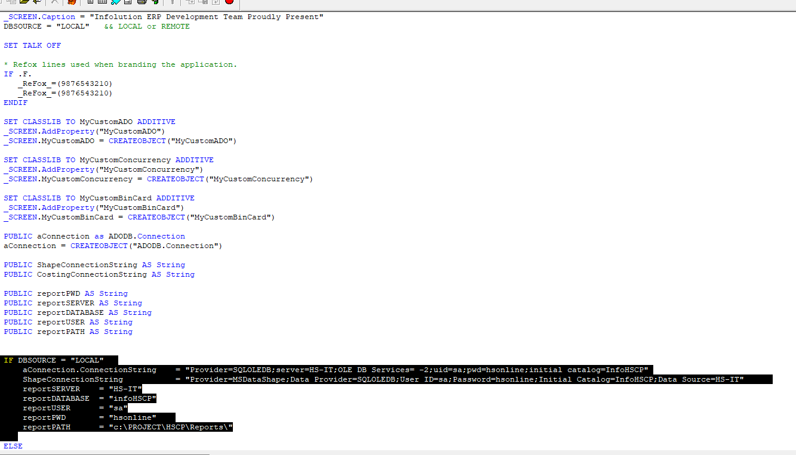

### AWS 信息

```
Product details
link: aws.amazon.com/ecs/instance-types/r6a/

Create estimate:Configure
link: calculator.aws/#/createCalulator/ec2-enhancement
path: AWS Pricing Calculator > My Estimate > Create estimate: Congidure Amazon EC2
```

#### Launch instances

```
Instance (running)
	- Launch instances
		- 1. Name: Database Server
		- 2. Quick start 选择 Windows (Microsoft)
		- 3. Amazon Machine Image (AMI) 选择 (Microsoft Windows Server 2022 with SQL Server 2022 Standard)
		- 4. Instance type 输入 r6a.large, 打勾 All generations
		- 5. Key pair (login) 点击 Create new key pair
			- Key pair name: HSG
			- 打勾 RSA
			- 打勾 .pem
			- 最后 点击 Create
		- 6. Network settings
			- Edit
			- VPC: vpc-063ede1d56d86a056
			- Subnet: subnet-04beaaf240c76ccaf
			- Firewall: Create security group
			- Security group name - required: HSG-Security-Group
			- Description - required: Hong Seng Group Security Group
		- 7. Inbound Security Group Rules
			- Type: MSSQL
			- Source type: Anywhere
		- 8. Configure storage
			- 1x (200)
			- GiB (gp2)
		- 9. Launch instance
	- Success
	
===
解释：
在 AWS (Amazon Web Services) 中，**Instance（实例）**是 EC2（Elastic Compute Cloud） 的一部分，它相当于云端的一台虚拟服务器。你可以在 AWS 上启动一个实例（Instance），然后在这个实例上运行操作系统和应用程序，就像使用物理服务器一样。

你列出的步骤是 在 AWS 上创建一台 Windows 数据库服务器实例，以下是解析：
Launch instances（启动实例）

你要创建一台虚拟服务器（Instance）。
选择 AMI（Amazon Machine Image）

你选择了 Windows Server 2022 + SQL Server 2022 Standard 作为服务器的操作系统和数据库。
选择实例类型（Instance type）

你选择了 r6a.large，这决定了这台服务器的 CPU、内存大小。
创建 Key Pair（密钥对）

你创建了 HSG.pem，这个用于远程连接到实例（RDP 远程桌面连接）。
设置网络（Network settings）

你把实例放在了一个特定的 VPC（Virtual Private Cloud）和子网（Subnet），确保它有正确的网络环境。
设置安全组（Security Group）

你创建了一个 Security Group（安全组） 叫 HSG-Security-Group，类似于防火墙。
你允许 MSSQL（SQL Server）端口对外开放，这样其他服务器可以连接到数据库。
配置存储（Storage）

你给实例配置了 200GB 的存储（EBS 卷，gp2 类型）。
启动实例（Launch instance）

一切配置完成后，你启动了这个实例，现在它在 AWS 上运行。
总结：
你在 AWS 上创建了一台 Windows Server 2022 + SQL Server 2022 Standard 的虚拟服务器，配置了网络、存储和安全规则。这个实例可以用来运行数据库或托管应用程序。
```


### =====

### SQL 信息

#### 信息

```
C:/Project/ 是本地已存在的数据库
D:/Data 自己从192.1.1.8 （R:） sqlbackup 复制的
```

```
1. Copy All && Paste All data
2. Design查看 
	- 列名（Column Name）
	- 数据类型（Data Type） 
	- 是否允许 NULL（Allow Nulls）
3. (右键)Design
	- Insert Column
```

#### 引入数据库

```
1. Database 右键 new database
	- 输入一样名称, 按OK
	
2. 右键新的Database->Tasks->Restore->Database

3. 选择 Device
	- Add
	- 寻找
	- 点击 OK
```

#### 不能登入ODBC

```
InfoHSG (如果ERP不能登入)
	- Security
		- Users
			- 删除 InfoHSA 和 InfoHSG(只有InfoHSG Table需要删除而已)
			
Security
	- Logins
		- 双击 InfoHSA 和 InfoHSG
			- 选择 User Mapping
				- 打勾 Info ?
				- 打勾 db_owner
				
====
创建新的，如果Logins没有

右键Logins，点击New Logins
	- 输入名称（infoHSTP）
	- 取消打勾所有 Enforce / User must...
	Default database: 选择已有的database
	User Mapping 一样 打勾两个，按OK
```

```
打开 ODBC Data
	- 选择 System DSN
		- 双击不能登入的名称 （InfoHSA）
			- 进入里面，切换自己SSMS的名字，按 NEXT ，输入密码，继续按NEXT，点击OK，可以了
```

### =====

### 号

#### ERP 号

```
Look at first
```

#### SQL 号

```
Look at first
```

### =====

### 通常 信息

#### 数据库

```
数据库名称：DESKTOP-BTSOF3M
```

#### 信息

```
Blue 是 ERP
Green 是 Account
```

```
最后 Build
```

#### 每次修改本地



```
Open / Close Project Manager
	- 点击 saccfman
		- 换成 LOCAL
		- 换成自己的 数据库名字
```

### =====

### 软件

```
UltraViewer (Remote 类似Anydesk)
```

### =====

### ERP(Account)

#### Add User

- `Account ERP Add User`

```
选择Database

Run Application
	- Admin -> Security -> Users
		- 点击 Last 查看最后User的Number（10042），按NEW，输入新的Number（10043）
		- ID输入HOO, FIRST: HOO, STAUTS: AH1, GROUP: AH1 -> 点击OK
		- Admin -> password -> 放大镜Icon搜寻用户，确认第一次密码，
		- 注：用户第一次登入，会要求用户自己更好密码
		
ID: Hoo
P: 0844
```

