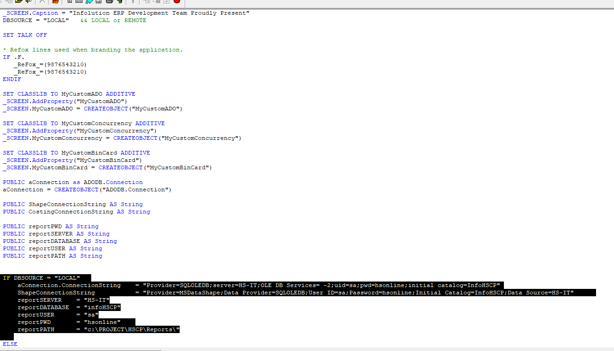

### AWS 信息

```
Product details
link: aws.amazon.com/ecs/instance-types/r6a/

Create estimate:Configure
link: calculator.aws/#/createCalulator/ec2-enhancement
path: AWS Pricing Calculator > My Estimate > Create estimate: Congidure Amazon EC2
```

#### Launch instances

```
在EC2 点击 Instance (running)
	- Launch instances
		- 1. Name: Database Server
		- 2. Quick start 选择 Windows (Microsoft)
		- 3. Amazon Machine Image (AMI) 选择 (Microsoft Windows Server 2022 with SQL Server 2022 Standard)
		- 4. Instance type 输入 r6a.large, 打勾 All generations
		- 5. Key pair (login) 点击 Create new key pair
			- Key pair name: HSG
			- 打勾 RSA
			- 打勾 .pem
			- 最后 点击 Create
		- 6. Network settings
			- Edit
			- VPC: vpc-063ede1d56d86a056
			- Subnet: subnet-04beaaf240c76ccaf
			- Firewall: Create security group
			- Security group name - required: HSG-Security-Group
			- Description - required: Hong Seng Group Security Group
		- 7. Inbound Security Group Rules
			- Type: MSSQL
			- Source type: Anywhere
		- 8. Configure storage
			- 1x (200)
			- GiB (gp2)
		- 9. Launch instance
	- Success
	
===
解释：
在 AWS (Amazon Web Services) 中，**Instance（实例）**是 EC2（Elastic Compute Cloud） 的一部分，它相当于云端的一台虚拟服务器。你可以在 AWS 上启动一个实例（Instance），然后在这个实例上运行操作系统和应用程序，就像使用物理服务器一样。

你列出的步骤是 在 AWS 上创建一台 Windows 数据库服务器实例，以下是解析：
Launch instances（启动实例）

你要创建一台虚拟服务器（Instance）。
选择 AMI（Amazon Machine Image）

你选择了 Windows Server 2022 + SQL Server 2022 Standard 作为服务器的操作系统和数据库。
选择实例类型（Instance type）

你选择了 r6a.large，这决定了这台服务器的 CPU、内存大小。
创建 Key Pair（密钥对）

你创建了 HSG.pem，这个用于远程连接到实例（RDP 远程桌面连接）。
设置网络（Network settings）

你把实例放在了一个特定的 VPC（Virtual Private Cloud）和子网（Subnet），确保它有正确的网络环境。
设置安全组（Security Group）

你创建了一个 Security Group（安全组） 叫 HSG-Security-Group，类似于防火墙。
你允许 MSSQL（SQL Server）端口对外开放，这样其他服务器可以连接到数据库。
配置存储（Storage）

你给实例配置了 200GB 的存储（EBS 卷，gp2 类型）。
启动实例（Launch instance）

一切配置完成后，你启动了这个实例，现在它在 AWS 上运行。
总结：
你在 AWS 上创建了一台 Windows Server 2022 + SQL Server 2022 Standard 的虚拟服务器，配置了网络、存储和安全规则。这个实例可以用来运行数据库或托管应用程序。
```

#### 配置 Instances

```
Action -> Security -> Get Windows password
	- Upload privatekey file
		- 放刚刚下载的 HSG.pem 文件
	- Decrypt password
	- 出现Models （Get Windows password） 按复制密码(可以保存在xsl) -> 点击 OK
```

#### 连接 Instances

```
Remote Desktop Connection
	- Computer: 输入其他 Instances 的 电脑连接 （看xsl文件）
	- user: administrator
	- password: 刚刚复制的 （可以保存在xml）
```

#### 下载 Invoice

```
点击 HS Vision One Sdh Bhd 右上角
	- Billng and Cost Management
		- Payments
			- Transactions
			- 点击 Invoice ID 下载
```

### =====

### SQL 信息

```
SELECT * FROM GDOC WHERE ISNULL(trailer_type,'') <> ''
```

### 更换sa密码 (错误中)

```
Security
	- Logins
		- sa 右键 （properties）[出现 model]
		- 记得打勾 Enforce password policy
		- Status -> 打勾Login Enabled -> 点击OK
		- 打开 Sql Server Configuration Manager
			- SQL Server Services
				- SQL Server (MSSQL) 右键 -> Rstart 
		- 右键 数据库名称 -> Disconnect
		- Menu -> File -> Connect Object Explorer
		- 重新登入
```

#### 信息

```
C:/Project/ 是本地已存在的数据库
D:/Data 自己从192.1.1.8 （R:） sqlbackup 复制的
```

```
1. Copy All && Paste All data
2. Design查看 
	- 列名（Column Name）
	- 数据类型（Data Type） 
	- 是否允许 NULL（Allow Nulls）
3. (右键)Design
	- Insert Column
```

#### 引入数据库

```
1. Database 右键 new database
	- 输入一样名称, 按OK
	
2. 右键新的Database->Tasks->Restore->Database

3. 选择 Device
	- Add
	- 寻找
	- Options
		- 打勾 Overwrite the existing database (WITH REPLACE)
		- 取消打勾 Take tail-log backup before restore
	- 点击 OK
```

#### 不能登入ODBC

```
InfoHSG (如果ERP不能登入)
	- Security
		- Users
			- 删除 InfoHSA 和 InfoHSG(只有InfoHSG Table需要删除而已)
			
Security
	- Logins
		- 双击 InfoHSA 和 InfoHSG
			- 选择 User Mapping
				- 打勾 Info ?
				- 打勾 db_owner
				
====
创建新的，如果Logins没有

右键Logins，点击New Logins
	- 输入名称（infoHSTP）
	- 取消打勾所有 Enforce / User must...
	Default database: 选择已有的database
	User Mapping 一样 打勾两个，按OK
```

```
打开 ODBC Data
	- 选择 System DSN
		- 双击不能登入的名称 （InfoHSA）
			- 进入里面，切换自己SSMS的名字，按 NEXT ，输入密码，继续按NEXT，点击OK，可以了
```

#### Create New Project

```
Database -> new database
```


### =====

### 号

#### ERP 号

```
Look at first
```

#### SQL 号

```
Look at first
```

### =====

### 通常 信息

#### 数据库

```
数据库名称：DESKTOP-BTSOF3M
```

#### 信息

```
Blue 是 ERP
Green 是 Account
```

```
最后 Build
```

#### 每次修改本地



```
Open / Close Project Manager
	- 点击 saccfman
		- 换成 LOCAL
		- 换成自己的 数据库名字
```

### =====

### 软件

```
UltraViewer (Remote 类似Anydesk)
```

```
UltraViewer 和 AWS 提供的远程桌面连接（Remote Desktop Connection, RDC）在功能、使用场景和安全性上有很大区别。以下是主要区别：

1. UltraViewer
✅ 用途：

主要用于 远程控制 和 远程支持，类似于 TeamViewer，可以让一个人远程访问和控制另一台计算机。
适用于 技术支持、协作和个人远程访问。
✅ 工作原理：

通过 ID + 密码 连接到对方的电脑，并远程控制鼠标、键盘。
支持 双向控制，即两台电脑可以互相控制。
需要安装 UltraViewer 客户端。
✅ 特点：

无需 VPN 或公有 IP，可以在任何网络环境下使用。
文件传输功能，适合远程办公和技术支持。
支持多人同时远程连接一台设备。
✅ 安全性：

连接时需要提供 ID 和密码，但安全性比企业级远程桌面方案低。
数据传输加密，但不如 AWS 提供的企业级安全方案。
2. AWS 远程桌面连接（Amazon WorkSpaces / EC2 RDP）
AWS 提供多种远程桌面解决方案，主要包括：

Amazon WorkSpaces（云端托管的 Windows / Linux 桌面）
EC2 RDP（使用 Microsoft RDP 连接 AWS EC2 Windows 实例）
✅ 用途：

适用于 企业远程办公、云端开发 和 远程服务器管理。
AWS 提供 完整的云端 Windows/Linux 桌面环境，类似于虚拟机。
可用于 运行 ERP 系统、企业软件、数据库服务器 等。
✅ 工作原理：

Amazon WorkSpaces：基于 AWS 云计算，用户通过 WorkSpaces 客户端连接到 AWS 云端托管的 Windows / Linux 桌面。
EC2 RDP：使用 Windows 自带的 Remote Desktop Protocol (RDP)，通过 公网 IP 或 VPN 访问 AWS 上的 Windows Server/实例。
✅ 特点：

需要 AWS 账户和权限，适用于企业内部或云端服务器管理。
高性能远程桌面体验，适合运行 ERP、开发工具、数据库等软件。
可配置企业级安全性（如 VPN 连接、IAM 权限管理、MFA）。
与 AWS 生态系统集成（如 S3 存储、AWS Directory Service）。
✅ 安全性：

更高的安全级别，支持 VPN、IAM 角色、多因素认证（MFA）。
企业级数据加密，可限制访问 IP 地址，避免未经授权的连接。
总结对比
特性	UltraViewer	AWS 远程桌面 (WorkSpaces / EC2 RDP)
主要用途	远程支持、个人远程访问	企业级远程办公、服务器管理
连接方式	ID + 密码	AWS 账户 + RDP/VPN
安装要求	需要安装 UltraViewer	WorkSpaces 客户端 或 Windows RDP
是否支持文件传输	是	仅 Amazon WorkSpaces 支持
安全性	较低（适合普通用户）	高（支持 VPN、IAM 角色等）
适用场景	远程技术支持、个人远程控制	企业办公、云服务器管理
如果你只是要远程访问另一台电脑，UltraViewer 更方便。
但如果你是管理 AWS 云端服务器或企业级远程办公，AWS 的远程桌面更合适。
```

### =====

### ERP(Account)

#### Add User

- `Account ERP Add User`

```
选择Database

Run Application
	- Admin -> Security -> Users
		- 点击 Last 查看最后User的Number（10042），按NEW，输入新的Number（10043）
		- ID输入HOO, FIRST: HOO, STAUTS: AH1, GROUP: AH1 -> 点击OK
		- Admin -> password -> 放大镜Icon搜寻用户，确认第一次密码，
		- 注：用户第一次登入，会要求用户自己更好密码
		
ID: Hoo
P: 0844
```

### =====

### Remote Desktop Connection

```
Control Panel
	- Region
		- Administrative
			- Change system locale
			- (Chinese (Traditional, Taiwan))
			- 需要 Restart
```

